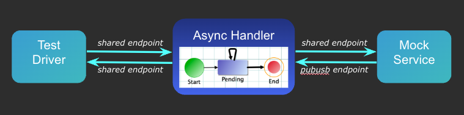

# State Machine for Async Service

## Overview

In this tutorial, we implement an asynchronous service by using a State Machine for the service handler.  Upon receipt of a client request, this service invokes other services, and collects multiple service responses, and then assembles and asynchronously returns a client response by using a FTL message endpoint.

The following figure illustrates the components of this project interacting via FTL endpoints.  Note that `pubsub` endpoint is used for the service handler to receive responses from the mock service, and so multiple service handlers can be deployed to process client requests concurrently.



Detailed description for this tutorial can be found in [Wiki page](https://github.com/learn-tibco-cep/tutorials/wiki/State-Machine-for-Async-Service)

## Components

### Handler State Machine

The main application logic is depicted by the state-machine diagram of the async handler (see the above figure).  Upon receipt of a client request, the service agent will create a new handler and change its state to `Pending`.  The preprocessor of the the client request will also send a service request to a mock service provider, which will return 1 or more service responses as specified by the service request.

While in the `Pending` state, the async handler will wait a max amount of time configured by a `global variable`.  If all expected number of service responses are received within the time limit, the handler will transition out of the `Pending` state, and return a client response message including the collection of service responses.  Otherwise, if the collected number of service responses is less than the expected number when the max wait time has reached, the handler will return a `Timeout` response containing only the partial service responses collected upto the max wait time.

### Performace Stat Collector

The project folder [Stats](./Stats) contains a utility used to collect and printout detailed application performance statistics that may not be clearly captured by other tools such as BE profiler or OpenTelemetry.

This utility is implemented by using BE rule-functions. The function [addStat](./Stats/addStat.rulefunction) allows you to aggregate any application-specific performance values (such as elapsed time) under a unique name.

The function [updateStats](./RuleFunctions/updateStats.rulefunction) shows how this utility can be used to aggregate and printout performance stats of the async handler.

### Mock Service

The project folder [TestMock](./TestMock) contains only a preprocessor function that generates multiple service responses according to a received service request.  It is used to support the functional and performance testing of the async handler.

This component is also an illustration on how easy it is to implement mock services in BE.

### Test Driver

The project folder [TestDriver](./TestDriver) is a multi-threaded client simulator used to support performance testing of the async handler.  It shows 2 commonly used techniques in BE applications.

* Use timer events to schedule delayed tasks.  At the startup of the test driver, the function [startup](./TestDriver/startup.rulefunction) schedules multiple request message publishers at random delays, so each publisher will start at a different time.  The delayed timer event will trigger the rule [DelayedDispatch](./TestDriver/DelayedDispatch.rule).
* Use local channel to spawn multiple threads.  Instead of starting message publishers in the `DelayedDispatch` rule, which would execute in the single timer thread, the `DelayedDispatch` rule sends a `dispatch` event to a local channel destination, which will be processed by the preprocessor function [publishClientRequests](./TestDriver/publishClientRequests.rulefunction) on a different thread.  This is a common technique to spawn multiple concurrent threads since BE does not allow you to create threads explicitly.

The test driver also implements a preprocessor function [onClientResponse](./TestDriver/onClientResponse.rulefunction) that subscribes response messsages and collects and prints out performance statistics.

The test driver is configured using the following `global variables`, whose default values are overridden by properties of the `test` PU in [Demo.cdd](./Demo.cdd).

|Variable Name|Description|Default|
|---|---|---|
|Test/Publishers|Number of concurrent publisher threads|3|
|Test/RequestCount|Number of requests to send per thread|1001|
|Test/RequestInterval|ms to sleep between consecutive requests|20|
|Test/PrintStats|Print stats after receiving this number of responses|200|

## Start FTL Server

This tutorial uses TIBCO FTL to exchange messages between BE application components.  To test this application, you must follow the instruction in [Prerequisites](https://github.com/learn-tibco-cep/tutorials/wiki/Prerequisites), install and start a FTL server.  For example, you may start FTL server in Docker:

```
docker run -d -p 8585:8585 ftl-tibftlserver:6.9.1 --name ftls1@$(hostname):8585
```

## Test the Application

Clone this repository, and import it into BE studio workspace, `$WS`, as a `Existing TIBCO BE Studio Project`.  Build the enterprise archive, e.g., `$WS/Demo.ear`.

### Start Inference Engines

```
$BE_HOME/bin/be-engine --propFile $BE_HOME/bin/be-engine.tra -n demo-1 -u default -c ${WS}/AsyncService/Demo.cdd Demo.ear
```

Optionally, start more inference engines for load distribution:

```
$BE_HOME/bin/be-engine --propFile $BE_HOME/bin/be-engine.tra -n demo-2 -u default -c ${WS}/AsyncService/Demo.cdd Demo.ear
```

### Start Mock Service

```
$BE_HOME/bin/be-engine --propFile $BE_HOME/bin/be-engine.tra -n mock -u mock -c ${WS}/AsyncService/Demo.cdd Demo.ear
```

### Start Test Driver

```
$BE_HOME/bin/be-engine --propFile $BE_HOME/bin/be-engine.tra -n test -u test -c ${WS}/AsyncService/Demo.cdd Demo.ear
```

## Test Results

On a MacBook Pro with 8-Core Intel Core i9 processor, this application printed out the following statistics for the default configuration with 3 test driver threads and each thread publishes requests at 50/s, i.e., for a total client request rate of `150/s`.

### Single Inference Engine

For a test that each client request expects 1 to 5 service responses, or average of 3 service responses per client request, the test driver printed the following stats after 2500 client requests. The handlers on the server elapsed `2.3 ms` on average.

```
[Complete-ServerElapsed] reset: 2500, elapsed: 23858 ms, rate: 125.744/s, count: 500, avg: 2.318, max: 10.000, min: 0.000
[Complete-ClientElapsed] reset: 2500, elapsed: 23859 ms, rate: 125.739/s, count: 500, avg: 3.822, max: 13.000, min: 1.000
```

More detailed stats from the handler state machine is as follows, which shows not only the end-to-end elapsed time, but also message delays on the FTL endpoint, load and lock time for handler objects, etc.

```
[ClientRequestDelay] reset: 2004, elapsed: 19885 ms, rate: 125.924/s, count: 500, avg: 0.890, max: 28.000, min: 0.000
[SendServiceRequest] reset: 2004, elapsed: 19885 ms, rate: 125.924/s, count: 500, avg: 0.576, max: 4.000, min: 0.000
[ServiceElapsed] reset: 6045, elapsed: 19885 ms, rate: 380.840/s, count: 1528, avg: 0.096, max: 1.000, min: 0.000
[ServiceEnd2End] reset: 6045, elapsed: 19885 ms, rate: 380.840/s, count: 1528, avg: 1.902, max: 38.000, min: 0.000
[AcquireHandlerLock] reset: 6046, elapsed: 19885 ms, rate: 380.890/s, count: 1528, avg: 0.393, max: 33.000, min: 0.000
[RetrieveHandler] reset: 6046, elapsed: 19885 ms, rate: 380.890/s, count: 1528, avg: 0.007, max: 1.000, min: 0.000
[ServiceResponseDelay] reset: 6046, elapsed: 19885 ms, rate: 380.840/s, count: 1527, avg: 0.496, max: 2.000, min: 0.000
[Complete-HandleElapsed] reset: 2003, elapsed: 19885 ms, rate: 125.874/s, count: 500, avg: 2.344, max: 38.000, min: 1.000
[Complete-ExpectedResponses] reset: 2003, elapsed: 19885 ms, rate: 125.874/s, count: 500, avg: 3.056, max: 5.000, min: 1.000
```

### Two Inference Engines

When 2 inference engines are deployed, each engine will process only half of the client requests.  Although the elapsed time for processing each request is similar to that of the single engine deployment, the total throughput would be doubled because the load is evenly distributed by 2 workers.

The test driver prints out the following stats.  It shows that 0.57% of the requests timed out due to race conditions that a service response is received before its handler concept is available.  Such race condition depends on the post RTC activities for sending outbound events and updating handler concepts.  Due to parallel processing, it is not garanteed that service request will be sent out after the handler concept is updated.  Such race condition can be better handled by adding a retry in the preprocessor function `onServiceResponse` when it failed to load the handler concept for the response event.  The current implementation simply drops the response event in such race condition, which leads to the observed request timeout.

```
[Complete-ServerElapsed] reset: 2476, elapsed: 23730 ms, rate: 124.947/s, count: 489, avg: 2.413, max: 39.000, min: 1.000
[Complete-ClientElapsed] reset: 2475, elapsed: 23730 ms, rate: 124.905/s, count: 489, avg: 4.057, max: 41.000, min: 1.000
[Timeout-ServerElapsed] reset: 0, elapsed: 23730 ms, rate: 0.464/s, count: 11, avg: 5005.818, max: 5013.000, min: 5003.000
[Timeout-ClientElapsed] reset: 0, elapsed: 23730 ms, rate: 0.464/s, count: 11, avg: 5007.545, max: 5015.000, min: 5004.000
```

The detailed stats printed by the inference engine 1:

```
[ClientRequestDelay] reset: 1000, elapsed: 23926 ms, rate: 62.484/s, count: 495, avg: 0.871, max: 18.000, min: 0.000
[SendServiceRequest] reset: 1000, elapsed: 23926 ms, rate: 62.484/s, count: 495, avg: 0.539, max: 5.000, min: 0.000
[ServiceElapsed] reset: 2911, elapsed: 23926 ms, rate: 181.852/s, count: 1440, avg: 0.101, max: 1.000, min: 0.000
[ServiceEnd2End] reset: 2911, elapsed: 23926 ms, rate: 181.852/s, count: 1440, avg: 1.984, max: 39.000, min: 0.000
[AcquireHandlerLock] reset: 5898, elapsed: 23926 ms, rate: 372.147/s, count: 3006, avg: 0.232, max: 5.000, min: 0.000
[RetrieveHandler] reset: 5890, elapsed: 23925 ms, rate: 371.661/s, count: 3002, avg: 0.006, max: 1.000, min: 0.000
[RetrieveExitHandler] reset: 0, elapsed: 23926 ms, rate: 0.502/s, count: 12, avg: 0.000, max: 0.000, min: 0.000
[ServiceResponseDelay] reset: 5889, elapsed: 23927 ms, rate: 371.505/s, count: 3000, avg: 0.617, max: 3.000, min: 0.000
[Complete-HandleElapsed] reset: 990, elapsed: 23926 ms, rate: 61.774/s, count: 488, avg: 2.398, max: 39.000, min: 1.000
[Complete-ExpectedResponses] reset: 990, elapsed: 23927 ms, rate: 61.771/s, count: 488, avg: 2.939, max: 5.000, min: 1.000
[Timeout-HandleElapsed] reset: 0, elapsed: 23926 ms, rate: 0.502/s, count: 12, avg: 5005.750, max: 5013.000, min: 5003.000
[Timeout-ExpectedResponses] reset: 0, elapsed: 23926 ms, rate: 0.502/s, count: 12, avg: 2.917, max: 5.000, min: 1.000
```

The detailed stats printed by the inference engine 2:

```
[ClientRequestDelay] reset: 1000, elapsed: 24170 ms, rate: 62.019/s, count: 499, avg: 0.910, max: 19.000, min: 0.000
[SendServiceRequest] reset: 1000, elapsed: 24170 ms, rate: 62.060/s, count: 500, avg: 0.610, max: 6.000, min: 0.000
[ServiceElapsed] reset: 2962, elapsed: 24170 ms, rate: 187.298/s, count: 1565, avg: 0.079, max: 1.000, min: 0.000
[ServiceEnd2End] reset: 2962, elapsed: 24170 ms, rate: 187.298/s, count: 1565, avg: 1.966, max: 7.000, min: 0.000
[AcquireHandlerLock] reset: 5893, elapsed: 24170 ms, rate: 369.632/s, count: 3041, avg: 0.231, max: 5.000, min: 0.000
[RetrieveHandler] reset: 5892, elapsed: 24170 ms, rate: 369.590/s, count: 3041, avg: 0.007, max: 1.000, min: 0.000
[ServiceResponseDelay] reset: 5892, elapsed: 24170 ms, rate: 369.549/s, count: 3040, avg: 0.587, max: 3.000, min: 0.000
[Complete-HandleElapsed] reset: 1000, elapsed: 24170 ms, rate: 62.060/s, count: 500, avg: 2.412, max: 9.000, min: 1.000
[Complete-ExpectedResponses] reset: 1000, elapsed: 24170 ms, rate: 62.060/s, count: 500, avg: 3.130, max: 5.000, min: 1.000
```
